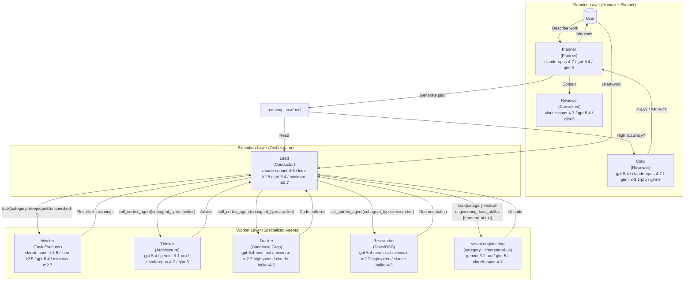
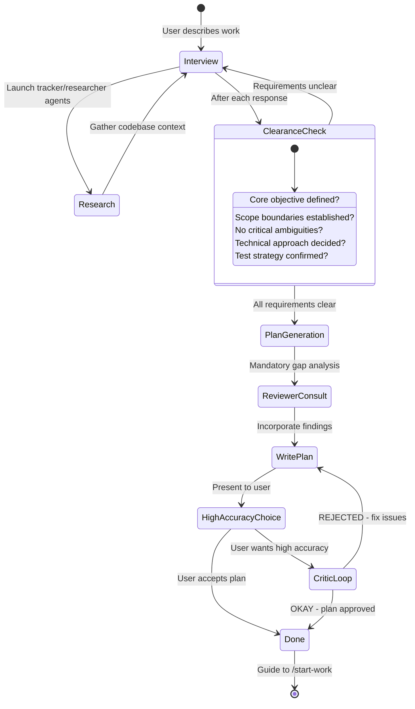
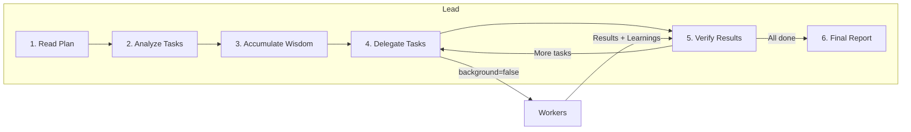

# Orchestration System Guide

Oh My OpenAgent's orchestration system transforms a simple AI agent into a coordinated development team through **separation of planning and execution**.

---

## TL;DR - When to Use What

| Complexity            | Approach                  | When to Use                                                                              |
| --------------------- | ------------------------- | ---------------------------------------------------------------------------------------- |
| **Simple**            | Just prompt               | Simple tasks, quick fixes, single-file changes                                           |
| **Complex + Lazy**    | Type `dw` or `deepwork` | Complex tasks where explaining context is tedious. Agent figures it out.                 |
| **Complex + Precise** | `@plan` → `/start-work`   | Precise, multi-step work requiring true orchestration. Planner plans, Lead executes. |

**Decision Flow:**

```

Is it a quick fix or simple task?
  └─ YES → Just prompt normally
  └─ NO  → Is explaining the full context tedious?
              └─ YES → Type "dw" and let the agent figure it out
              └─ NO  → Do you need precise, verifiable execution?
                         └─ YES → Use @plan for Planner planning, then /start-work
                         └─ NO  → Just use "dw"
```

---

## The Architecture

The orchestration system uses a three-layer architecture that solves context overload, cognitive drift, and verification gaps through specialization and delegation.



Model labels above show the current fallback stacks from `src/shared/model-requirements.ts`, not marketing names.

---

## Planning: Planner + Reviewer + Critic

### Planner: Your Strategic Consultant

Planner is not just a planner, it's an intelligent interviewer that helps you think through what you actually need. It is **READ-ONLY** - can only create or modify markdown files within `.cortex/` directory.

**The Interview Process:**



**Intent-Specific Strategies:**

Planner adapts its interview style based on what you're doing:

| Intent                 | Planner Focus               | Example Questions                                          |
| ---------------------- | ------------------------------ | ---------------------------------------------------------- |
| **Refactoring**        | Safety - behavior preservation | "What tests verify current behavior?" "Rollback strategy?" |
| **Build from Scratch** | Discovery - patterns first     | "Found pattern X in codebase. Follow it or deviate?"       |
| **Mid-sized Task**     | Guardrails - exact boundaries  | "What must NOT be included? Hard constraints?"             |
| **Architecture**       | Strategic - long-term impact   | "Expected lifespan? Scale requirements?"                   |

### Reviewer: The Gap Analyzer

Before Planner writes the plan, Reviewer catches what Planner missed:

- Hidden intentions in user's request
- Ambiguities that could derail implementation
- AI-slop patterns (over-engineering, scope creep)
- Missing acceptance criteria
- Edge cases not addressed

**Why Reviewer Exists:**

The plan author (Planner) has "ADHD working memory" - it makes connections that never make it onto the page. Reviewer forces externalization of implicit knowledge.

### Critic: The Ruthless Reviewer

For high-accuracy mode, Critic validates plans against four core criteria:

1. **Clarity**: Does each task specify WHERE to find implementation details?
2. **Verification**: Are acceptance criteria concrete and measurable?
3. **Context**: Is there sufficient context to proceed without >10% guesswork?
4. **Big Picture**: Is the purpose, background, and workflow clear?

**The Critic Loop:**

Critic only says "OKAY" when:

- 100% of file references verified
- ≥80% of tasks have clear reference sources
- ≥90% of tasks have concrete acceptance criteria
- Zero tasks require assumptions about business logic
- Zero critical red flags

If REJECTED, Planner fixes issues and resubmits. No maximum retry limit.

---

## Execution: Lead

### The Conductor Mindset

Lead is like an orchestra conductor: it doesn't play instruments, it ensures perfect harmony.



**What Lead CAN do:**

- Read files to understand context
- Run commands to verify results
- Use lsp_diagnostics to check for errors
- Search patterns with grep/glob/ast-grep

**What Lead MUST delegate:**

- Writing or editing code files
- Fixing bugs
- Creating tests
- Git commits

### Wisdom Accumulation

The power of orchestration is cumulative learning. After each task:

1. Extract learnings from subagent's response
2. Categorize into: Conventions, Successes, Failures, Gotchas, Commands
3. Pass forward to ALL subsequent subagents

This prevents repeating mistakes and ensures consistent patterns.

**Notepad System:**

```
.cortex/notepads/{plan-name}/
├── learnings.md      # Patterns, conventions, successful approaches
├── decisions.md      # Architectural choices and rationales
├── issues.md         # Problems, blockers, gotchas encountered
├── verification.md   # Test results, validation outcomes
└── problems.md       # Unresolved issues, technical debt
```

---

## Workers: Worker and Specialists

### Worker: The Task Executor

Junior is the workhorse that actually writes code. Key characteristics:

- **Focused**: Cannot delegate (blocked from task tool)
- **Disciplined**: Obsessive todo tracking
- **Verified**: Must pass lsp_diagnostics before completion
- **Constrained**: Cannot modify plan files (READ-ONLY)

**Why the fallback chain is sufficient:**

Junior doesn't need to be the smartest - it needs to be reliable. With:

1. Detailed prompts from Lead (50-200 lines)
2. Accumulated wisdom passed forward
3. Clear MUST DO / MUST NOT DO constraints
4. Verification requirements

Even a mid-tier execution model works when the harness is strict. The current fallback order is `claude-sonnet-4-6` → `kimi-k2.5` → `gpt-5.4` → `minimax-m2.7` → `big-pickle`. The intelligence is in the **system**, not a single worker model.

### System Reminder Mechanism

The hook system ensures Junior never stops halfway:

```
[SYSTEM REMINDER - TODO CONTINUATION]

You have incomplete todos! Complete ALL before responding:
- [ ] Implement user service ← IN PROGRESS
- [ ] Add validation
- [ ] Write tests

DO NOT respond until all todos are marked completed.
```

This "workstate pushing" mechanism is why the system is named after Chief.

---

## Category + Skill System

### Why Categories are Revolutionary

**The Problem with Model Names:**

```typescript
// OLD: Model name creates distributional bias
task({ agent: "gpt-5.4", prompt: "..." }); // Model knows its limitations
task({ agent: "claude-opus-4-7", prompt: "..." }); // Different self-perception
```

**The Solution: Semantic Categories:**

```typescript
// NEW: Category describes INTENT, not implementation
task({ category: "ultrabrain", prompt: "..." }); // "Think strategically"
task({ category: "visual-engineering", prompt: "..." }); // "Design beautifully"
task({ category: "quick", prompt: "..." }); // "Just get it done fast"
```

### Built-in Categories

| Category             | Default config                  | Runtime fallback order                                                                 | When to Use                                                 |
| -------------------- | ------------------------------- | -------------------------------------------------------------------------------------- | ----------------------------------------------------------- |
| `visual-engineering` | `google/gemini-3.1-pro high`   | `gemini-3.1-pro` → `glm-5` → `claude-opus-4-7` → `glm-5` → `k2p5`                     | Frontend, UI/UX, design, styling, animation                 |
| `ultrabrain`         | `openai/gpt-5.4 xhigh`         | `gpt-5.4` → `gemini-3.1-pro` → `claude-opus-4-7` → `glm-5`                             | Deep logical reasoning, complex architecture decisions      |
| `deep`               | `openai/gpt-5.4 medium`        | `gpt-5.4` → `claude-opus-4-7` → `gemini-3.1-pro`                                       | Goal-oriented autonomous problem-solving, thorough research |
| `artistry`           | `google/gemini-3.1-pro high`   | `gemini-3.1-pro` → `claude-opus-4-7` → `gpt-5.4`                                       | Highly creative or artistic tasks, novel ideas              |
| `quick`              | `openai/gpt-5.4-mini`          | `gpt-5.4-mini` → `claude-haiku-4-5` → `gemini-3-flash` → `minimax-m2.7` → `gpt-5-nano` | Trivial tasks, single file changes, typo fixes              |
| `unspecified-low`    | `anthropic/claude-sonnet-4-6`  | `claude-sonnet-4-6` → `gpt-5.3-codex` → `kimi-k2.5` → `gemini-3-flash` → `minimax-m2.7` | Tasks that don't fit other categories, low effort           |
| `unspecified-high`   | `anthropic/claude-opus-4-7 max` | `claude-opus-4-7` → `gpt-5.4` → `glm-5` → `k2p5` → `kimi-k2.5`                          | Tasks that don't fit other categories, high effort          |
| `writing`            | `kimi-for-coding/k2p5`         | `gemini-3-flash` → `kimi-k2.5` → `claude-sonnet-4-6` → `minimax-m2.7`                  | Documentation, prose, technical writing                     |

### Skills: Domain-Specific Instructions

Skills prepend specialized instructions to subagent prompts:

```typescript
// Category + Skill combination
task(
  (category = "visual-engineering"),
  (load_skills = ["frontend-ui-ux"]), // Adds UI/UX expertise
  (prompt = "..."),
);

task(
  (category = "deep"),
  (load_skills = ["playwright"]), // Adds browser automation expertise
  (prompt = "..."),
);
```

---

## Usage Patterns

### How to Invoke Planner

**Method 1: Switch to Planner Agent (Tab → Select Planner)**

```
1. Press Tab at the prompt
2. Select "Planner" from the agent list
3. Describe your work: "I want to refactor the auth system"
4. Answer interview questions
5. Planner creates plan in .cortex/plans/{name}.md
```

**Method 2: Use @plan Command (in Chief)**

```
1. Stay in Chief (default agent)
2. Type: @plan "I want to refactor the auth system"
3. The @plan command automatically switches to Planner
4. Answer interview questions
5. Planner creates plan in .cortex/plans/{name}.md
```

**Which Should You Use?**

| Scenario                          | Recommended Method         | Why                                                  |
| --------------------------------- | -------------------------- | ---------------------------------------------------- |
| **New session, starting fresh**   | Switch to Planner agent | Clean mental model - you're entering "planning mode" |
| **Already in Chief, mid-work** | Use @plan                  | Convenient, no agent switch needed                   |
| **Want explicit control**         | Switch to Planner agent | Clear separation of planning vs execution contexts   |
| **Quick planning interrupt**      | Use @plan                  | Fastest path from current context                    |

Both methods trigger the same Planner planning flow. The @plan command is simply a convenience shortcut.

### /start-work Behavior and Session Continuity

**What Happens When You Run /start-work:**

```
User: /start-work
    ↓
[start-work hook activates]
    ↓
Check: Does .cortex/workstate.json exist?
    ↓
    ├─ YES (existing work) → RESUME MODE
    │   - Read the existing workstate state
    │   - Calculate progress (checked vs unchecked boxes)
    │   - Inject continuation prompt with remaining tasks
    │   - Lead continues where you left off
    │
    └─ NO (fresh start) → INIT MODE
        - Find the most recent plan in .cortex/plans/
        - Create new workstate.json tracking this plan
        - Switch session agent to Lead
        - Begin execution from task 1
```

**Session Continuity Explained:**

The `workstate.json` file tracks:

- **active_plan**: Path to the current plan file
- **session_ids**: All sessions that have worked on this plan
- **started_at**: When work began
- **plan_name**: Human-readable plan identifier

**Example Timeline:**

```
Monday 9:00 AM
  └─ @plan "Build user authentication"
  └─ Planner interviews and creates plan
  └─ User: /start-work
  └─ Lead begins execution, creates workstate.json
  └─ Task 1 complete, Task 2 in progress...
  └─ [Session ends - computer crash, user logout, etc.]

Monday 2:00 PM (NEW SESSION)
  └─ User opens new session (agent = Chief by default)
  └─ User: /start-work
  └─ [start-work hook reads workstate.json]
  └─ "Resuming 'Build user authentication' - 3 of 8 tasks complete"
  └─ Lead continues from Task 3 (no context lost)
```

Lead is automatically activated when you run `/start-work`. You don't need to manually switch to Lead.

### Founder vs Chief + deepwork

**Quick Comparison:**

| Aspect          | Founder                                 | Chief + `dw` / `deepwork`                       |
| --------------- | ------------------------------------------ | ---------------------------------------------------- |
| **Model**       | `gpt-5.4` (`medium`)                       | `claude-opus-4-7` / `kimi-k2.5` / `gpt-5.4` / `glm-5` depending on setup |
| **Approach**    | Autonomous deep worker                     | Keyword-activated deepwork mode                     |
| **Best For**    | Complex architectural work, deep reasoning | General complex tasks, "just do it" scenarios        |
| **Planning**    | Self-plans during execution                | Uses Planner plans if available                   |
| **Delegation**  | Heavy use of tracker/researcher agents      | Uses category-based delegation                       |
| **Temperature** | 0.1                                        | 0.1                                                  |

**When to Use Founder:**

Switch to Founder (Tab → Select Founder) when:

1. **Deep architectural reasoning needed**
   - "Design a new plugin system"
   - "Refactor this monolith into microservices"

2. **Complex debugging requiring inference chains**
   - "Why does this race condition only happen on Tuesdays?"
   - "Trace this memory leak through 15 files"

3. **Cross-domain knowledge synthesis**
   - "Integrate our Rust core with the TypeScript frontend"
   - "Migrate from MongoDB to PostgreSQL with zero downtime"

4. **You specifically want GPT-5.4 reasoning**
   - Some problems benefit from GPT-5.4's training characteristics

**When to Use Chief + `dw`:**

Use the `dw` keyword in Chief when:

1. **You want the agent to figure it out**
   - "dw fix the failing tests"
   - "dw add input validation to the API"

2. **Complex but well-scoped tasks**
   - "dw implement JWT authentication following our patterns"
   - "dw create a new CLI command for deployments"

3. **You're feeling lazy** (officially supported use case)
   - Don't want to write detailed requirements
   - Trust the agent to tracker and decide

4. **You want to leverage existing plans**
   - If a Planner plan exists, `dw` mode can use it
   - Falls back to autonomous exploration if no plan

**Recommendation:**

- **For most users**: Use `dw` keyword in Chief. It's the default path and works excellently for 90% of complex tasks.
- **For power users**: Switch to Founder when you specifically need GPT-5.4's reasoning style or want the "deep-work systems deep mode" experience of fully autonomous exploration and execution.

---

## Configuration

You can control related features in `oh-my-cortex.json`:

```jsonc
{
  "chief_agent": {
    "disabled": false, // Enable Lead orchestration (default: false)
    "planner_enabled": true, // Enable Planner (default: true)
    "replace_plan": true, // Replace default plan agent with Planner (default: true)
  },

  // Hook settings (add to disable)
  "disabled_hooks": [
    // "start-work",             // Disable execution trigger
    // "planner-md-only"      // Remove Planner write restrictions (not recommended)
  ],
}
```

---

## Troubleshooting

### "I switched to Planner but nothing happened"

Planner enters interview mode by default. It will ask you questions about your requirements. Answer them, then say "make it a plan" when ready.

### "/start-work says 'no active plan found'"

Either:

- No plans exist in `.cortex/plans/` → Create one with Planner first
- Plans exist but workstate.json points elsewhere → Delete `.cortex/workstate.json` and retry

### "I'm in Lead but I want to switch back to normal mode"

Type `exit` or start a new session. Lead is primarily entered via `/start-work` - you don't typically "switch to Lead" manually.

### "What's the difference between @plan and just switching to Planner?"

**Nothing functional.** Both invoke Planner. @plan is a convenience command while switching agents is explicit control. Use whichever feels natural.

### "Should I use Founder or type dw?"

**For most tasks**: Type `dw` in Chief.

**Use Founder when**: You specifically need GPT-5.4's reasoning style for deep architectural work or complex debugging.

---

## Further Reading

- [Overview](./overview.md)
- [Features Reference](../reference/features.md)
- [Configuration Reference](../reference/configuration.md)
- [Manifesto](../manifesto.md)
